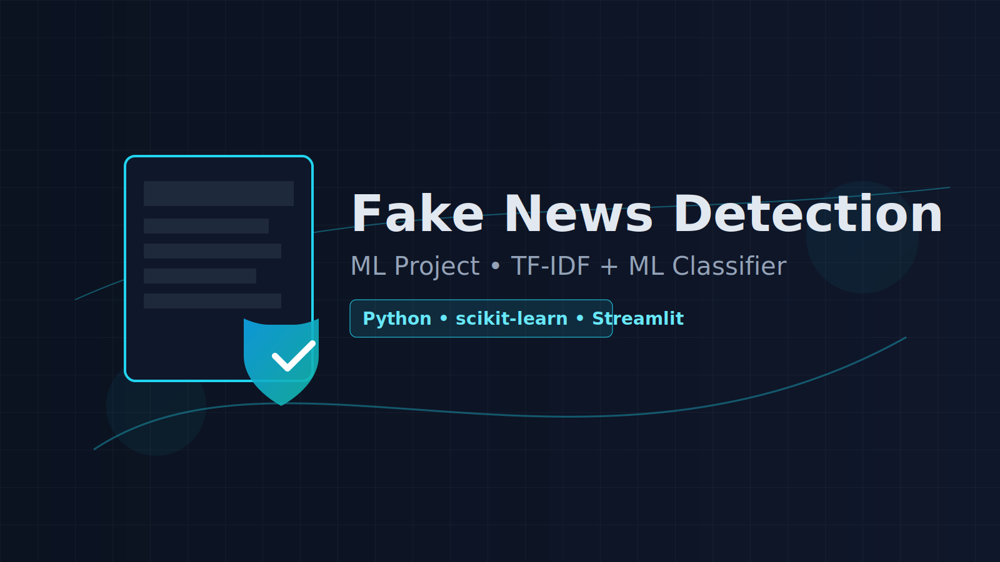

## 📰 Fake News Detection (ML Project)

Welcome! This project builds a machine learning model to detect fake news. It includes data preprocessing, model training, and a simple app interface.

### ✨ Features
- **Data preprocessing**: cleaning, tokenization, vectorization
- **Model training**: classic ML baseline(s)
- **Simple app**: predict whether a news text is real or fake

### 📦 Tech Stack
- **Language**: Python 3.9+
- **Core**: `scikit-learn`, `pandas`, `numpy`
- **App**: `streamlit`

### 📁 Folder Structure
```text
ML _project/Data_Science_Fake_News_Detection-
├─ app/
│  └─ app.py.py              # App entry point (Streamlit or CLI script)
├─ data_set/
│  └─ fake_news_dataset.csv  # Dataset (text + label)
├─ model/                    # Trained model artifacts (to be saved here)
├─ README.md                 # Project documentation (this file)
└─ req.txt                   # Project requirements
```

### 🧭 What’s in each folder?
- `app/`: Contains the app code to run inference. You can expand it with UI code, input forms, and model loading.
- `data_set/`: Raw/processed datasets. Keep large files out of version control if needed.
- `model/`: Place exported models here (e.g., `model.pkl`, vectorizer files).

### 🚀 Setup & Quickstart
1) Create and activate a virtual environment
2) Install dependencies from `req.txt`
3) Run the app

```bash
python -m venv .venv
.venv\Scripts\activate      # Windows PowerShell
pip install -r req.txt
streamlit run app/app.py.py
```

If not using Streamlit, run directly:
```bash
python app/app.py.py
```

### 🧾 Requirements
All dependencies are listed in `req.txt`. Update it if you add/remove libraries.

### 📊 Dataset
- Expected columns: article text/content, label (fake/real)
- File: `data_set/fake_news_dataset.csv`

### 🧠 Model
- Baseline: TF-IDF + classic ML classifier(s)
- Save artifacts (model and vectorizer) into `model/`

### 🛠️ Development Tips
- Use Python 3.9+
- Keep secrets and large data outside of version control

### ✅ To Do
- [ ] Add training script and/or notebook
- [ ] Export trained model to `model/`
- [ ] Improve app UI/UX

### 📄 License
Educational purpose. Add a license for distribution.

### 🙌 Acknowledgments
Thanks to open-source libraries and datasets that make this possible.

— Built with ❤️ and a curiosity for truth